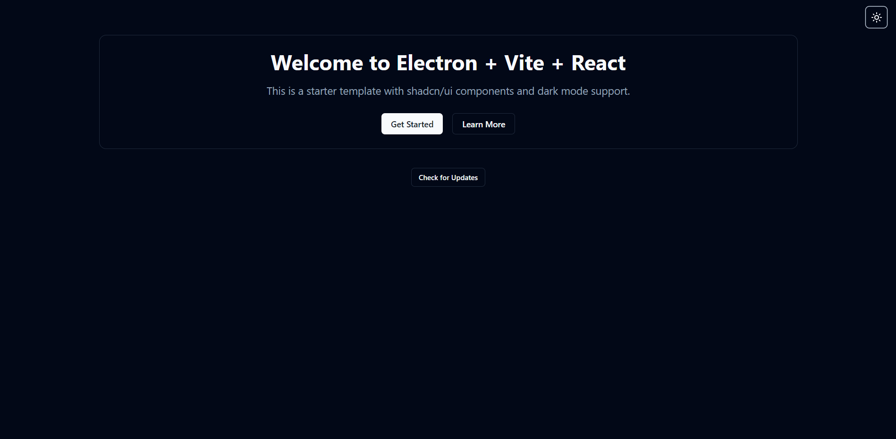

          
# Vite-Electron-ShadCn-AutoUpdater


A modern Electron application template built with Vite, React, TypeScript, and ShadCn/UI components, featuring an integrated auto-update system.


## ✨ Features

- 🔋 **Electron** - Cross-platform desktop application framework
- ⚡️ **Vite** - Next generation frontend tooling
- ⚛️ **React** - JavaScript library for building user interfaces
- 🎨 **ShadCn/UI** - Beautiful, accessible UI components
- 🔄 **Auto-Update** - Seamless application updates via GitHub releases
- 🌙 **Dark Mode** - Built-in dark mode support
- 📦 **TypeScript** - Type safety for your application
- 🧩 **Component-based** - Modular architecture for easy maintenance

## 🚀 Quick Start

```bash
# Clone the repository
git clone https://github.com/Muhammad-Usman-911/Vite-Electron-ShadCn-AutoUpdater.git

# Navigate to the project directory
cd Vite-Electron-ShadCn-AutoUpdater

# Install dependencies
npm install

# Start development server
npm run dev
```

## 📂 Project Structure

```
├── electron                                 # Electron-related code
│   ├── main                                 # Main-process source code
│   │   ├── index.ts                         # Main entry point
│   │   └── update.ts                        # Auto-update functionality
│   └── preload                              # Preload-scripts source code
│
├── release                                  # Generated after production build
│   └── {version}                            # Version-specific builds
│       ├── {os}-{os_arch}                   # OS-specific unpacked application
│       └── {app_name}_{version}.{ext}       # Installer for the application
│
├── public                                   # Static assets
└── src                                      # Renderer source code (React application)
    ├── components                           # UI components
    │   ├── ui                               # ShadCn UI components
    │   └── update                           # Update dialog component
    ├── styles                               # Global styles
    └── type                                 # TypeScript type definitions
```

## 🛠️ Build

```bash
# Build the application
npm run build
```

This will create a packaged application in the `release/{version}` directory.

## 🔄 Auto-Update System

This template includes a complete auto-update system that allows your application to check for, download, and install updates automatically. The system uses GitHub releases as the update source.

### How Auto-Update Works

1. The application checks for updates using the `electron-updater` package
2. If an update is available, users are notified with an update dialog
3. Users can choose to download and install the update
4. The application will restart automatically after the update is installed

### Update Dialog

The update dialog provides a user-friendly interface for the update process:

- Shows the current and new version numbers
- Displays download progress with a progress bar
- Provides clear error messages if something goes wrong
- Allows users to install the update with a single click

### Setting Up Auto-Update for Your Repository

To configure the auto-update system for your own repository, modify the `publish` section in the `electron-builder.json` file:

```json
"publish": {
  "provider": "github",
  "owner": "YOUR_GITHUB_USERNAME",
  "repo": "YOUR_REPOSITORY_NAME",
  "releaseType": "release"
}
```

Replace:
- `YOUR_GITHUB_USERNAME` with your GitHub username
- `YOUR_REPOSITORY_NAME` with your repository name

### Creating GitHub Releases

To publish updates:

1. Increment the version number in `package.json`
2. Build your application with `npm run build`
3. Create a new release on GitHub
4. Upload the generated installer files from the `release/{version}` directory
5. Publish the release

Your users will then be able to download and install the update automatically.

## 🧩 Key Components

### Update Dialog

The update dialog component (`src/components/update/UpdateDialog.tsx`) provides a user interface for the auto-update process. It shows:

- Update availability
- Download progress
- Installation button
- Error messages

### Main Process Update Handler

The update handler (`electron/main/update.ts`) manages the auto-update process in the main Electron process:

- Checks for updates
- Downloads updates
- Installs updates
- Communicates with the renderer process

## 🔧 Configuration

### electron-builder.json

This file contains the configuration for building and packaging your Electron application, including:

- Application ID
- Output directory
- Build targets (Windows, macOS)
- NSIS installer options
- Auto-update configuration

### vite.config.ts

This file configures the Vite build process for both the renderer and main processes.

## 🧪 Testing

The project includes Playwright for end-to-end testing:

```bash
# Run tests
npm run test
```

## 📝 License

This project is licensed under the MIT License - see the LICENSE file for details.

## 🙏 Acknowledgements

- [Electron](https://www.electronjs.org/)
- [Vite](https://vitejs.dev/)
- [React](https://reactjs.org/)
- [ShadCn/UI](https://ui.shadcn.com/)
- [electron-updater](https://www.npmjs.com/package/electron-updater)

---

Created by [Muhammad Usman](https://github.com/Muhammad-Usman-911)