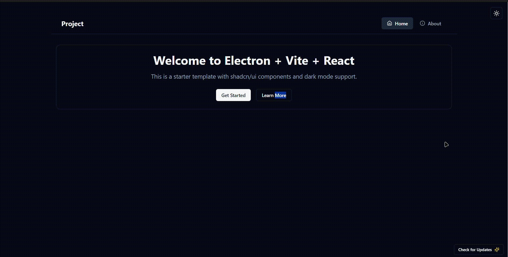

# Vite-Electron-ShadCn-AutoUpdater


A modern Electron application template built with Vite, React, TypeScript, and ShadCn/UI components, featuring an integrated auto-update system.

 <!-- If you convert the video to a gif -->


## ✨ Features

- **Electron 33+**: Latest Electron framework for desktop applications
- **Vite 5**: Fast development and build tooling
- **React 18**: Modern React with hooks and concurrent features
- **TypeScript**: Type-safe code for better developer experience
- **ShadCn/UI**: Beautiful, accessible UI components
- **Auto-Update System**: Built-in update mechanism using GitHub releases
- **Dark Mode**: Fully implemented dark/light theme support
- **Responsive Design**: Works on various screen sizes
- **Electron Builder**: Configured for easy distribution

## 🚀 Quick Start

```bash
# Clone the repository
git clone https://github.com/YOUR_USERNAME/YOUR_REPO_NAME.git

# Navigate to the project directory
cd YOUR_REPO_NAME

# Install dependencies
npm install

# Start the development server
npm run dev
```

## 📦 Building for Production

```bash
# Build the application
npm run build
```

The packaged application will be available in the `release/{version}` directory.

## 🔄 Auto-Update System

This template includes a complete auto-update system that allows your application to check for, download, and install updates automatically. The system uses GitHub releases as the update source.

### Setting Up Auto-Update

To configure the auto-update system for your own repository, modify the `publish` section in the `electron-builder.json` file:

```json
"publish": {
  "provider": "github",
  "owner": "YOUR_GITHUB_USERNAME",
  "repo": "YOUR_REPOSITORY_NAME",
  "releaseType": "release"
}
```

### Creating GitHub Releases

To publish updates:

1. Increment the version number in `package.json`
2. Build your application with `npm run build`
3. Create a new release on GitHub
4. Upload the generated installer files from the `release/{version}` directory
5. Publish the release

## 🧪 Testing

```bash
# Run tests
npm run test
```

## 🔧 Configuration Files

- **electron-builder.json**: Configuration for building and packaging
- **vite.config.ts**: Vite build configuration
- **tailwind.config.js**: Tailwind CSS configuration
- **components.json**: ShadCn/UI components configuration

## 🧩 Key Components

### Update Dialog

The update dialog (`src/components/update/UpdateDialog.tsx`) provides a user interface for the auto-update process. It shows:
- Update availability
- Download progress
- Installation button
- Error messages

### Main Process Update Handler

The main process update handler (`electron/main/update.ts`) manages:
- Checking for updates
- Downloading updates
- Installing updates
- Communicating with the renderer process

# Electron Preload Script

The preload script in this Electron application serves as a secure bridge between the renderer process (React frontend) and the main process (Electron backend). It uses Electron's contextBridge API to safely expose IPC (Inter-Process Communication) functionality to the frontend without compromising security.

## How it's set up

The preload script exposes a carefully selected set of `ipcRenderer` methods through the context bridge:
- `on`: Listens for events from the main process
- `off`: Removes event listeners
- `send`: Sends one-way messages to the main process
- `invoke`: Makes request-response style calls to the main process

Additionally, the preload script implements a loading animation that displays during application startup and automatically removes itself once the application is ready.

## Adding new IPC features

One of the advantages of this implementation is that **you don't need to modify the preload script** when adding new IPC functionality. The preload script is designed with a generic pattern that exposes the core IPC methods that can work with any channel name.

To add a new IPC feature:
1. Define a new handler in the main process using `ipcMain.handle()` or `ipcMain.on()`
2. Call it from the renderer process using the already exposed `window.ipcRenderer.invoke()` or `window.ipcRenderer.send()`

This approach maintains the security benefits of context isolation while providing flexibility for expanding the application's functionality.

## 📝 License

This project is licensed under the MIT License - see the LICENSE file for details.

## 🙏 Acknowledgements

- [Electron](https://www.electronjs.org/)
- [Vite](https://vitejs.dev/)
- [React](https://reactjs.org/)
- [ShadCn/UI](https://ui.shadcn.com/)
- [electron-updater](https://www.npmjs.com/package/electron-updater)

---

Created by [Muhammad Usman](https://github.com/Muhammad-Usman-911)

  